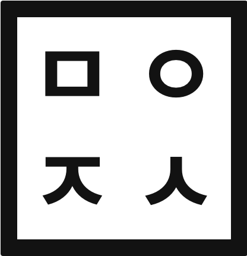
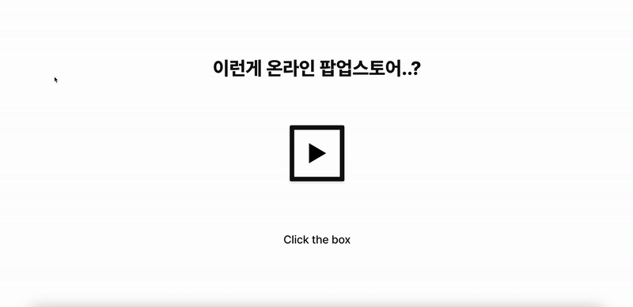
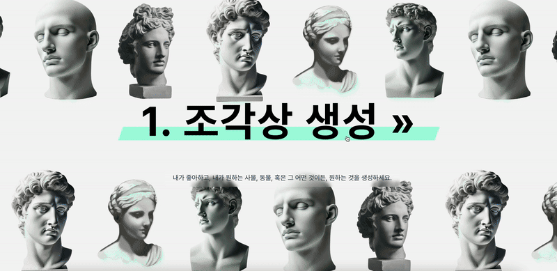
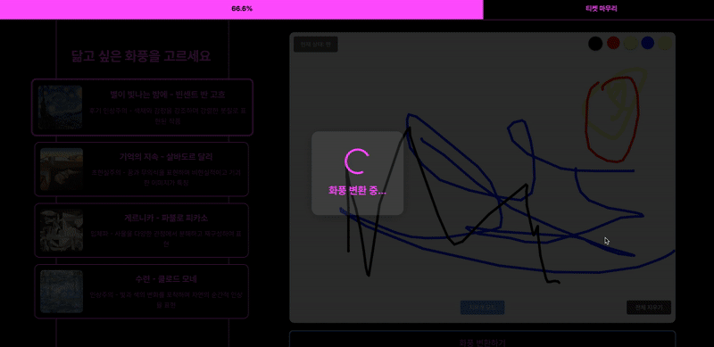
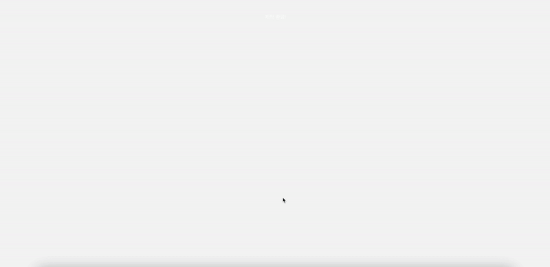

# 몰입 전시회 온라인 팝업 스토어 '조성제'

<!--배지-->
![Repository Size][repository-size-shield]

<!--프로젝트 대문 이미지-->




# [1] About the Project

- **몰입캠프 3주차 프로젝트**
- 온라인 팝업 스토어를 웹으로 개발하고, 웹 내에서 Generative AI Model들을 활용해서 티켓을 만드는 참여형 팝업 스토어를 개발했다.

## Features
- 기존의 팝업 스토어와 달리, 웹사이트에서 간편히 접근 가능하게 하여 접근성을 높였다.

- 자신이 넣은 단어, 그림을 조합하여 하나의 티켓을 만들어내는 과정으로, 참여형으로 개발하여 더욱 몰입할 수 있게 된다.

## Technologies

- [Python](https://www.python.org/) 3.11.5
- [Svelte](https://svelte.dev/) 5.15.0
- [Vite](https://vite.dev/) 6.0.5
- [Fastapi](https://fastapi.tiangolo.com/) 0.115.8
- [Pytorch](https://pytorch.org/) 2.4.1

## Used Models

- [stable-diffusion-3-medium](https://huggingface.co/stabilityai/stable-diffusion-3-medium)
    - 프롬포트를 통해 이미지를 생성하도록 설계된 text-to-Image 모델.
- [pastiche](https://github.com/dstein64/pastiche)
    - Neural Style Transfer를 활용한 Image-to-Image 모델. 

- [사용모델 코드들](https://github.com/Ea3124/MadCamp3rdModel)

# [2] Getting Started

## Prerequisites
1. Node.js가 설치되어 있지 않다면, 먼저 설치하세요.

- [Node.js 공식 사이트](https://nodejs.org/)
- **권장 버전**: 최신 LTS 버전

설치 여부 확인:

```sh
node -v
npm -v
```

2. Python 설치 (필요한 경우)  
   [Python 공식 사이트](https://www.python.org/)
   설치 여부 확인:

   ```sh
   python --version
   ```

3. 가상 환경 설정 (선택 사항) 
   프로젝트 환경을 격리하기 위해 가상 환경을 사용하는 것이 좋습니다.

   ```sh
   python -m venv venv
   source venv/bin/activate  # macOS/Linux
   venv\Scripts\activate     # Windows
   ```

## Installation

1. Repository 클론
```bash
git clone https://https://github.com/Ea3124/MadCamp3thWeek
```

<br><br>

2. 프로젝트 의존성 설치

프로젝트의 `package.json`에 정의된 패키지를 설치합니다.

```sh
npm install
```
<br><br>

3. **필수 패키지 설치**  
   
`requirements.txt`을 확인하여 필요한 패키지를 설치합니다.

```sh
pip install -r requirements.txt
```


<br><br>

4. 프로젝트 실행 - frontend


```sh
npm run dev
```
<br><br>

5. 프로젝트 실행 - backend

```sh
uvicorn main:app --host 0.0.0.0 --port 8000 --reload
```

- 백엔드가 `.env` 파일을 필요로 한다면 `.env.example`을 참고하여 `.env` 파일을 생성한 후 환경 변수를 로드하기

   ```sh
   cp .env.example .env
   ```

---

## Configuration

- nothing for configuration


# [3] AI 모델 기반 온라인 팝업 스토어 기능 및 동작 방식

## **📌 Intro**  


## **📌 Page 1 (조각상 사진 생성 페이지)**  



### **📄 Page1_1.svelte**  
✅ **주요 기능:**  
1. 사용자가 원하는 조각상 키워드를 입력하여 조각상 이미지를 생성  
2. 추천 키워드 목록을 제공  
3. 사용자가 입력한 텍스트를 GPU 서버로 전송하여 Text-to-Image 변환  

✅ **핵심 코드:**  
- `sculptureText`: 사용자가 입력한 텍스트 저장  
- `sculptureImage`: 서버에서 받아온 조각상 이미지 URL 저장  
- `recommendedNames`: 추천 키워드 목록 제공  

<br><br>

## **📌 Page 2 (화풍 변환 페이지)**


### **📄 Page2_0.svelte**  
✅ **주요 기능:**  
1. 사용자가 선택한 유명 예술 작품 스타일로 그림을 변환  
2. 사용자가 직접 그린 그림을 업로드 가능  

✅ **핵심 코드:**  
- `vangoghImage`, `monetImage`, `picassoImage`, `daliImage`: 화풍 변환을 위한 유명 예술 작품 이미지 목록  
- `isHovered`: UI 애니메이션을 위한 변수  
- `resultImage`: 변환된 이미지 저장  

<br><br>

### **📄 Page2.svelte**  
✅ **주요 기능:**  
1. 사용자가 직접 그림을 그릴 수 있는 캔버스 제공  
2. 선택한 화풍으로 사용자의 그림을 변환  
3. 변환된 그림을 사용자에게 제공  

✅ **핵심 코드:**  
- `Canvas.svelte`를 사용하여 사용자가 그림을 그릴 수 있는 인터페이스 제공  
- `resultImageStore`: 변환된 그림 데이터를 저장하는 Svelte store  

<br><br>

## **📌 Page 3 (인적 사항 입력 페이지)**



### **📄 Page3.svelte**  
✅ **주요 기능:**  
1. 사용자가 이름, 전화번호, 전시회 방문 예정일 입력  
2. 생성한 조각상 작품과 배경 확인 가능  
3. 입력이 완료되면 티켓이 생성됨  

✅ **핵심 코드:**  
- `userName`, `phoneNumber`, `visitDate`: 사용자 입력 값 저장  
- `showPhoneInput`, `showDateInput`: 입력 필드 표시 여부 조절  
- `isFormCompleted`: 입력이 완료되었는지 확인  

<br><br>

## **📌 Page 4 (티켓 생성 페이지)**



### **📄 Page4.svelte**  
✅ **주요 기능:**  
1. 완성된 티켓을 확인하고 저장 가능  
2. ‘저장하기’ 버튼을 누르면 티켓이 이미지로 저장됨  
3. ‘홈으로 돌아가기’ 버튼을 통해 홈으로 이동 가능  

✅ **핵심 코드:**  
- `html2canvas` 라이브러리를 사용하여 티켓을 이미지로 변환 및 저장  
- `userName`, `visitDate`: 사용자 정보 표시  
- `showTicket`: 티켓 표시 여부 관리  

---


# [4] Team Introduce

|Model(Backend) & UI|Frontend & Model|
|:---:|:---:|
|  |  |
|[이승재](https://github.com/Ea3124)|[강민우](https://github.com/minwookang219)|
|leesj6717@gmail.com| minwookang219@gmail.com |

 
<!--Url for Badges-->
[repository-size-shield]: https://img.shields.io/github/repo-size/Ea3124/MadCamp3rdWeek?labelColor=D8D8D8&color=BE81F7

<!--Url for Buttons-->
[readme-eng-shield]: https://img.shields.io/badge/-readme%20in%20english-2E2E2E?style=for-the-badge
[view-demo-shield]: https://img.shields.io/badge/-%F0%9F%98%8E%20view%20demo-F3F781?style=for-the-badge
[view-demo-url]: https://dev-ujin.github.io
[report-bug-shield]: https://img.shields.io/badge/-%F0%9F%90%9E%20report%20bug-F5A9A9?style=for-the-badge
[report-bug-url]: https://github.com/dev-ujin/readme-template/issues
[request-feature-shield]: https://img.shields.io/badge/-%E2%9C%A8%20request%20feature-A9D0F5?style=for-the-badge
[request-feature-url]: https://github.com/dev-ujin/readme-template/issues

<!--URLS-->
[license-url]: LICENSE.md
[contribution-url]: CONTRIBUTION.md
[readme-eng-url]: ../README.md

